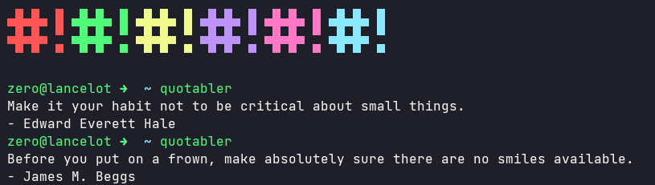

# Quotabler

[](https://gitmoji.dev)
[](https://opensource.org/licenses/MIT)




## Installation

```bash
go get github.com/UltiRequiem/quotabler
```

To be able to execute the command anywhere you need to have correctly setup your [Gopath](https://golang.org/doc/gopath_code).

Example: [Dotfiles](https://github.com/UltiRequiem/dotfiles/blob/53fece48cc95521e67a7a9277d6146aa14fe32f3/.zshrc#L32)

## Usage

```bash
quotabler
```

### License

This project is Licensed under the [MIT](./LICENSE.md) License.

### Alternative

I also developed this in [Node.js](https://github.com/UltiRequiem/ranmess) and [Python](https://github.com/UltiRequiem/quoteran).
