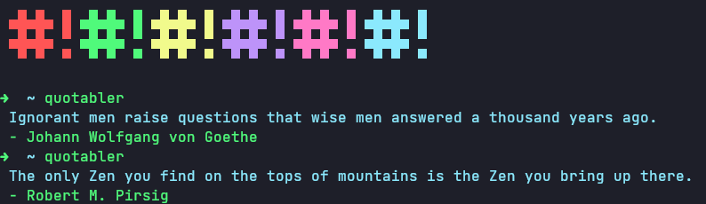

# Quotable

[](https://gitmoji.dev)
[](https://opensource.org/licenses/MIT)




A golang wrapper around the [Quotable.io API](https://api.quotable.io/random).

## Installation

If you just want to use the CLI app:

```bash
go install github.com/UltiRequiem/quotable@latest
```

To be able to execute the command anywhere you need to have correctly setup your [Gopath](https://golang.org/doc/gopath_code).

Example: [Dotfiles](https://github.com/UltiRequiem/dotfiles/blob/53fece48cc95521e67a7a9277d6146aa14fe32f3/.zshrc#L32)

If you want to use it in code:

```bash
go get github.com/UltiRequiem/quotabler/pkg
```

## Usage

CLI:

```bash
quotable
```

Code:

```go
package main

import (
	"github.com/UltiRequiem/quotable/pkg"
	"fmt"
)

func main() {
	quote, _ := quotable.GetRandomQuoteAndAuthor()
	fmt.Println(quote)
}
```

### Exports

This package exports 3 things:

- [`Quotable`](https://github.com/UltiRequiem/quotable/blob/main/pkg/root.go#L7): A struct with the properties that a fetch returns to the Quotable API.
- [`GetQuotableObject`](https://github.com/UltiRequiem/quotable/blob/main/pkg/root.go#L18): It fetches the Quotable API, returns a [`Quotable`](https://github.com/UltiRequiem/quotable/blob/main/pkg/root.go#L7).
- [`GetRandomQuoteAndAuthor`](https://github.com/UltiRequiem/quotable/blob/main/pkg/root.go#L27): Uses [`GetQuotableObject`](https://github.com/UltiRequiem/quotable/blob/main/pkg/root.go#L18) but only returns quote and author property.

### License

This project is Licensed under the [MIT](./LICENSE.md) License.

### Alternatives

I also developed this in [Node.js](https://github.com/UltiRequiem/ranmess) and [Python](https://github.com/UltiRequiem/quoteran).
